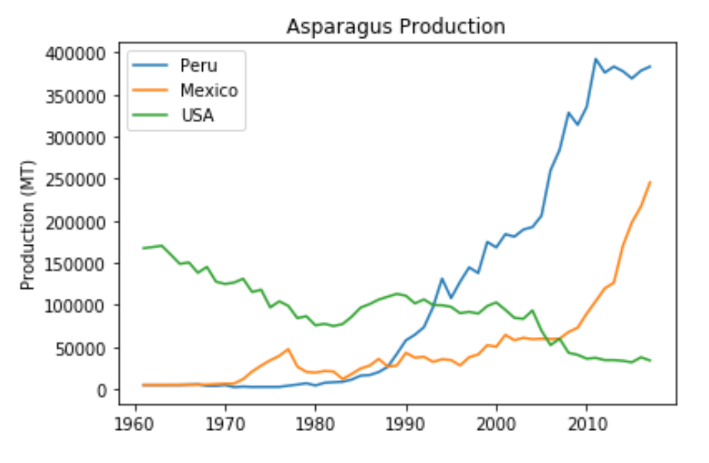
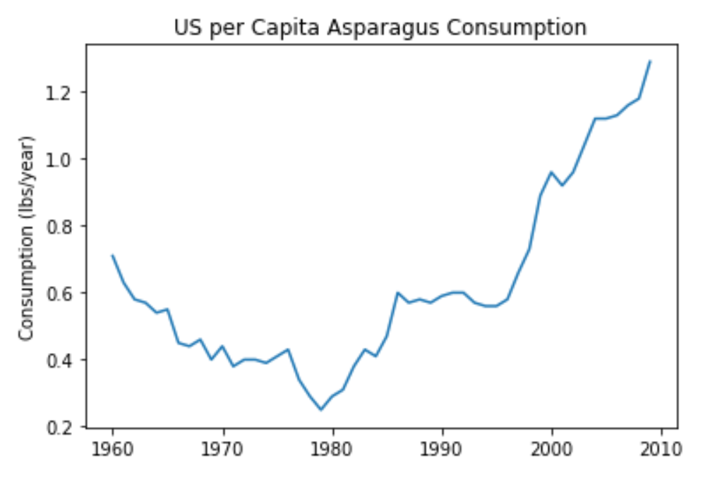
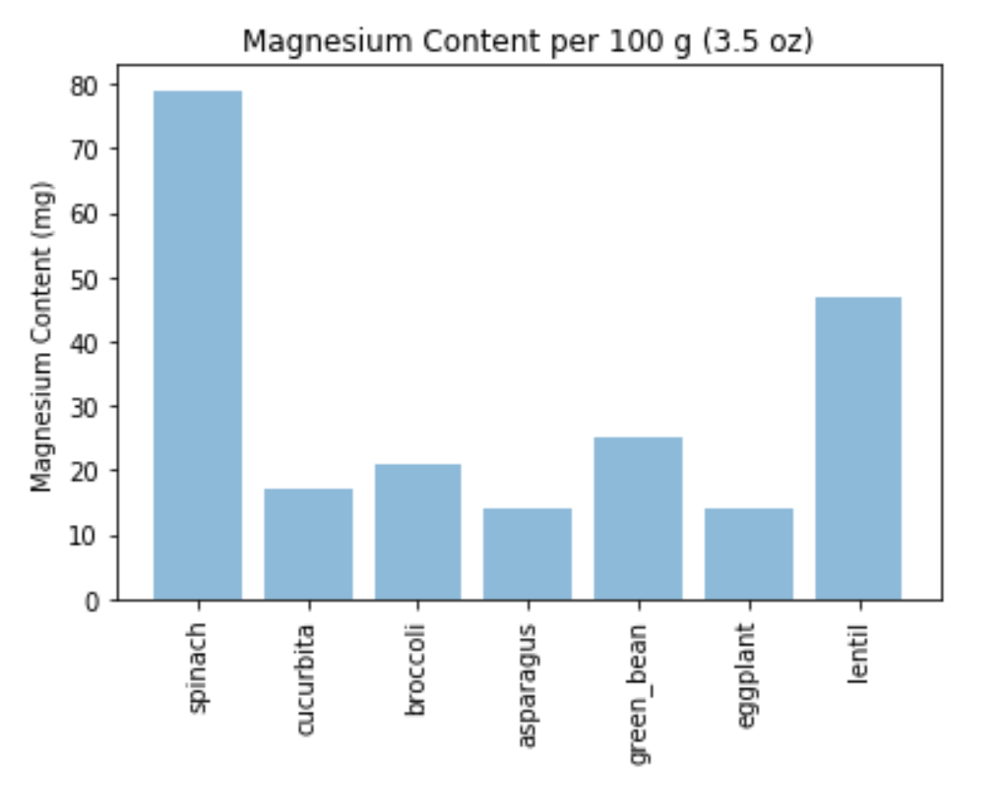

# Vegetables
A demonstration of ETL (Extract-Transform-Load) techniques that have been used to acquire information concerning vegetables. Investigations have been conducted into three areas: 

<ul>
    <li>Consumption & Production of vegetables,</li>
    <li>Nutritional value of vegetables,</li>
    <li>Recipes that use vegetables.</li>
</ul>

<p>
    
Each of the above areas is represented by a Jupyter Notebook containing Python code that performs ETL operations that culminate in the population of a MongoDB Database. The extraction phase for each area of interest involves web-scraping and data processing using Python libraries such as Pandas, Beautiful Soup as well as the Python ```requests``` library. The Pandas library is also used for data transformation. 

</p>

<p>
    
Prior to the loading phase, a number of charts a produced using the ```matplotlib``` Python library. Loading of the MongoDB database is achieved programmatically with Python by using the ```pymongo``` library.

</p>

<p align="center">
      
</p>

<p align="center">
    <strong>Asparagus Production since 1961</strong>
</p>


<h2>Web-scraping</h2>
Information has been scraped from the following websites:
<br>
<ul>
    <li>www.allrecipes.com for recipes</li>
    <li>www.simplyrecipes.com for recipes</li>
    <li>www.statista.com for information on the production of asparagus in 2017</li>
    <li>www.factfish.com for information on the world-wide production of all vegetables</li>  
    <li>www.wikipedia.com for nutritional information</li>
</ul>

as well as ```Table08.csv``` (Table 8--U.S. fresh asparagus: Supply, utilization, and price, farm weight, 1960-2010) sourced from the USDA-ERS ```AsparagusStats2010.pdf```.

<h2>Pictorial Observations</h2>
<p>The following chart depicts notable US per capita consumption of asparagus since 1961. This contrasts with a decline in US asparagus production during the same period (see image presented during the introduction).</p>

<p align="center">
      
</p>

<p>The following chart indicates that magnesium defficiency might be treated by a diet that is rich in spinach !</p> 

<p align="center">
      
</p>

